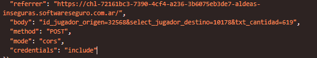

# Aldeas inseguras - UTN-FRC

**Dificultad:** CTF
**Fecha:** 09/2026
**Sistema:** Web
**Objetivo:** Conseguir al menos 5000 de oro
**Acceso inicial:** Manipulación de parámetros + abuso de lógica de negocio

## Herramientas

`Chrome DevTools` `Burp Suite`

## Técnicas

`Web Enumeration` `HTTP Request Analysis` `Parameter Manipulation` `Access Control Analysis` `Business Logic`

## Introducción

El desafío consiste en ayudar a Pedro a conseguir al menos **5000 monedas de oro** para construir una nueva aldea.

Cada jugador dispone de oro, plata y bronce. Solamente el oro puede enviarse entre aldeas.

La aplicación establece que una aldea puede recibir oro una vez por día, mientras que puede realizar múltiples envíos a diferentes aldeas.

El objetivo es analizar el funcionamiento de la aplicación y encontrar una forma de alcanzar la cantidad requerida de oro.

## Reconocimiento

Al acceder a la aplicación se observa una funcionalidad para enviar mercancías entre diferentes jugadores.

El formulario realiza una petición `POST` al siguiente endpoint:

```text
/src/ctl/enviar_mercancia.ctl.php
````

Entre los parámetros enviados se encuentra:

```text
id_jugador_origen
select_jugador_destino
txt_cantidad
```

El parámetro `id_jugador_origen` se encuentra definido como un campo `hidden` dentro del formulario.

### Jugador actual

El usuario autenticado corresponde a Pedro:

```text
ID: 32568
Oro: 619
Plata: 150
Bronce: 150
```

También se identifican las siguientes aldeas:

| Jugador  |    ID |  Oro |
| -------- | ----: | ---: |
| Alfonzo  | 10178 | 2501 |
| Juana    |  1901 | 1000 |
| Santiago | 22358 | 1520 |

La cantidad total de oro disponible entre las otras aldeas es:

```text
2501 + 1000 + 1520 = 5021
```

Por lo tanto, existe suficiente oro para alcanzar el objetivo de 5000.

## Análisis de la petición

Al realizar un envío normal se observa una petición similar:

```http
POST /src/ctl/enviar_mercancia.ctl.php
```

con los siguientes parámetros:



El valor `32568` corresponde al identificador de Pedro.

Este parámetro resulta interesante porque es enviado directamente por el cliente y no parece estar vinculado directamente a la sesión mediante un valor que el usuario no pueda modificar.

## Manipulación de parámetros

Se modifica manualmente el parámetro:

```text
id_jugador_origen
```

para comprobar si el servidor valida que el jugador indicado corresponda realmente al usuario autenticado.

Por ejemplo, se utiliza el identificador de Santiago:

```text
id_jugador_origen=22358
```

La petición modificada permite comprobar que el identificador de origen puede ser alterado desde el cliente.

Esto evidencia una deficiencia en el control de acceso: el servidor utiliza un identificador proporcionado por el cliente para determinar el jugador que participa en la operación.

## Análisis de la lógica de negocio

El desafío incorpora una restricción adicional:

> Una aldea solamente puede recibir oro una vez por día.

Esto significa que no es posible simplemente enviar directamente todo el oro disponible de Alfonzo, Juana y Santiago hacia Pedro mediante varias transferencias.

Sin embargo, cada aldea puede realizar múltiples envíos.

Esta diferencia entre las restricciones de **envío** y **recepción** permite utilizar una aldea como intermediaria.

## Explotación

Se utiliza Santiago como aldea intermediaria.

El flujo de las transferencias es:

```text
Alfonzo ──┐
          ├──> Santiago ───> Pedro
Juana ────┘
```

### Transferencia desde Alfonzo

Se realiza una transferencia de oro desde Alfonzo hacia Santiago.

```text
Origen: Alfonzo
ID: 10178

Destino: Santiago
ID: 22358
```

### Transferencia desde Juana

Posteriormente se realiza otra transferencia desde Juana hacia Santiago.

```text
Origen: Juana
ID: 1901

Destino: Santiago
ID: 22358
```

De esta manera Santiago acumula el oro recibido de las otras aldeas.

### Transferencia hacia Pedro

Finalmente, Santiago puede realizar una única transferencia hacia Pedro:

```text
Origen: Santiago
ID: 22358

Destino: Pedro
ID: 32568
```

Al realizar una única recepción, Pedro evita la restricción de recibir oro múltiples veces durante el mismo día.


## Vulnerabilidad

La aplicación presenta un problema de **control de acceso** debido a que el identificador del jugador de origen es enviado directamente desde el cliente:

```text
id_jugador_origen
```

Un servidor correctamente implementado debería obtener el jugador asociado a la sesión autenticada y comprobar que este tenga autorización para realizar la operación.

Además, existe una vulnerabilidad de **lógica de negocio**, ya que las restricciones de transferencia pueden combinarse utilizando una aldea intermediaria.

## Cadena de explotación

```text
Inspección del formulario
        ↓
Análisis de petición HTTP
        ↓
Manipulación de parámetros
        ↓
Control de acceso deficiente
        ↓
Análisis de lógica de negocio
        ↓
Uso de aldea intermediaria
        ↓
Pedro alcanza 5000 de oro
```

## Conclusión

El desafío demuestra la importancia de validar en el servidor todos los datos relacionados con autorización y recursos.

El hecho de que `id_jugador_origen` sea un campo `hidden` no proporciona ningún mecanismo de seguridad, ya que cualquier valor enviado por el navegador puede ser modificado.

La combinación de la manipulación del identificador de origen y las reglas de envío y recepción permite aprovechar la lógica de negocio de la aplicación para alcanzar el objetivo de 5000 monedas de oro.

## Evidencias

> Agregar aquí las capturas correspondientes al proceso:
>
> * Formulario de envío de mercancías.
> * Petición HTTP original.
> * Parámetro `id_jugador_origen`.
> * Petición modificada.
> * Transferencias entre aldeas.
> * Estado final de Pedro.

```
