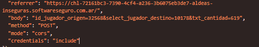

# Aldeas Inseguras - SoftwareSeguro

**Dificultad:** CTF  
**Fecha:** 09/2026  
**Sistema:** Web  
**Objetivo:** Conseguir al menos 5000 de oro  
**Acceso inicial:** Manipulación de parámetros + abuso de lógica de negocio  

## Herramientas

`Chrome DevTools` `Burp Suite`

## Técnicas

`Web Enumeration` `HTTP Request Analysis` `Parameter Manipulation` `IDOR` `Business Logic Abuse`

## Introducción

El desafío consiste en ayudar a Pedro a conseguir al menos **5000 monedas de oro** para construir una nueva aldea. Cada jugador dispone de oro, plata y bronce; solo el oro puede enviarse entre aldeas. La aplicación establece que una aldea puede **recibir** oro una única vez por día, aunque puede **enviar** múltiples veces. El objetivo es encontrar una forma de alcanzar la cantidad requerida respetando (o explotando) esas reglas.

## Reconocimiento

La funcionalidad de envío de mercancías realiza una petición `POST` a:

```text
/src/ctl/enviar_mercancia.ctl.php
```

con parámetros `id_jugador_origen`, `select_jugador_destino` y `txt_cantidad`. El parámetro `id_jugador_origen` está definido como un campo `hidden` en el formulario.

**Jugador actual (Pedro):** ID `32568`, oro `619`.

**Otras aldeas:**

| Jugador  |    ID |  Oro |
| -------- | ----: | ---: |
| Alfonzo  | 10178 | 2501 |
| Juana    |  1901 | 1000 |
| Santiago | 22358 | 1520 |

El oro total disponible entre las otras aldeas (`2501 + 1000 + 1520 = 5021`) es suficiente para alcanzar el objetivo, si se lograra concentrarlo en la cuenta de Pedro.

## Análisis de la petición

Al realizar un envío normal se observa que `id_jugador_origen` viaja como parámetro controlado por el cliente:



Al tratarse de un campo `hidden`, es modificable directamente desde el inspector antes del envío. Esto sugiere que el servidor podría no estar verificando que el jugador de origen corresponda realmente al usuario autenticado en la sesión.

## Vulnerabilidad identificada

**IDOR combinado con abuso de lógica de negocio (CWE-639: Authorization Bypass Through User-Controlled Key + CWE-841: Improper Enforcement of Behavioral Workflow)**

Por un lado, el servidor confía en el valor de `id_jugador_origen` enviado por el cliente para determinar qué jugador origina la transferencia, en lugar de derivarlo de la sesión autenticada — cualquier usuario puede enviar oro **en nombre de cualquier otra aldea**, no solo la propia.

Por otro lado, la aplicación impone una restricción de negocio asimétrica: una aldea puede **enviar** oro múltiples veces por día, pero solo puede **recibir** una vez. Esta regla, pensada para limitar la acumulación directa de oro, no contempla el uso de una aldea como intermediaria: es posible enviar oro desde varias aldeas distintas hacia una única aldea intermedia (que solo recibe una vez per remitente, sin límite de remitentes distintos) y luego reenviar el total acumulado en una sola transferencia final.

## Explotación

Se combina el IDOR (modificar `id_jugador_origen` para operar como cualquier aldea) con la falla de lógica de negocio, usando **Santiago** como intermediario:

```text
Alfonzo ──┐
          ├──> Santiago ───> Pedro
Juana ────┘
```

**1. Transferencia desde Alfonzo hacia Santiago:**
```text
id_jugador_origen=10178 (Alfonzo) -> destino: Santiago (22358)
```

**2. Transferencia desde Juana hacia Santiago:**
```text
id_jugador_origen=1901 (Juana) -> destino: Santiago (22358)
```

Santiago acumula el oro recibido de ambas aldeas (recibe dos veces de remitentes distintos, no viola la regla de "una recepción por remitente/día" tal como está implementada).

**3. Transferencia final desde Santiago hacia Pedro:**
```text
id_jugador_origen=22358 (Santiago) -> destino: Pedro (32568)
```

Al ser una única recepción para Pedro, se respeta formalmente la restricción de "una recepción por día", y el oro acumulado en Santiago llega completo a la cuenta de Pedro.


## Impacto

La combinación de ambas fallas permite a cualquier usuario autenticado mover oro **desde cualquier aldea del juego hacia cualquier otra**, sin restricción real más allá de la interfaz. Esto rompe por completo la economía del juego: no se trata solo de que Pedro alcance 5000 de oro, sino que cualquier jugador podría vaciar el oro de cualquier otra aldea en su propio beneficio, ya que el origen de cada transferencia no está atado a la identidad autenticada.

## Evidencia

### Campo hidden de origen

```html
id_jugador_origen (hidden, valor modificable desde el cliente)
```

### Estado inicial

```text
Pedro (32568): 619 oro
Alfonzo (10178): 2501 oro
Juana (1901): 1000 oro
Santiago (22358): 1520 oro
```

### Secuencia de transferencias

```text
Alfonzo (10178) -> Santiago (22358)
Juana (1901)     -> Santiago (22358)
Santiago (22358) -> Pedro (32568)
```

### Resultado

```text
Pedro >= 5000 oro
```

## Conclusión

El desafío demuestra la importancia de validar en el servidor todos los datos relacionados con identidad y autorización, y de diseñar reglas de negocio que consideren escenarios de intermediación. El hecho de que `id_jugador_origen` sea un campo `hidden` no aporta ninguna garantía de seguridad, ya que cualquier valor enviado por el navegador puede modificarse libremente. La combinación de esta falla con una regla de negocio asimétrica (restricción solo en la recepción, no en el envío, sin límite de remitentes distintos) permitió concentrar oro ajeno en la cuenta de Pedro.

## Mitigación

1. Derivar siempre el jugador de origen de la sesión autenticada en el servidor, ignorando cualquier identificador de origen enviado por el cliente.
2. Revisar las reglas de negocio pensando en escenarios de intermediación: una restricción "una vez por día" aplicada solo a la recepción, sin límite de remitentes distintos, es trivialmente evadible usando una cuenta puente.
3. Registrar y limitar el volumen total de oro movido por una misma cuenta en una ventana de tiempo, no solo la cantidad de transacciones.
