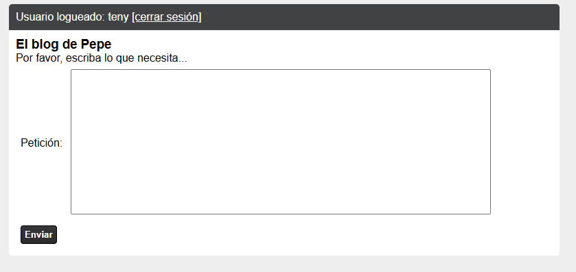
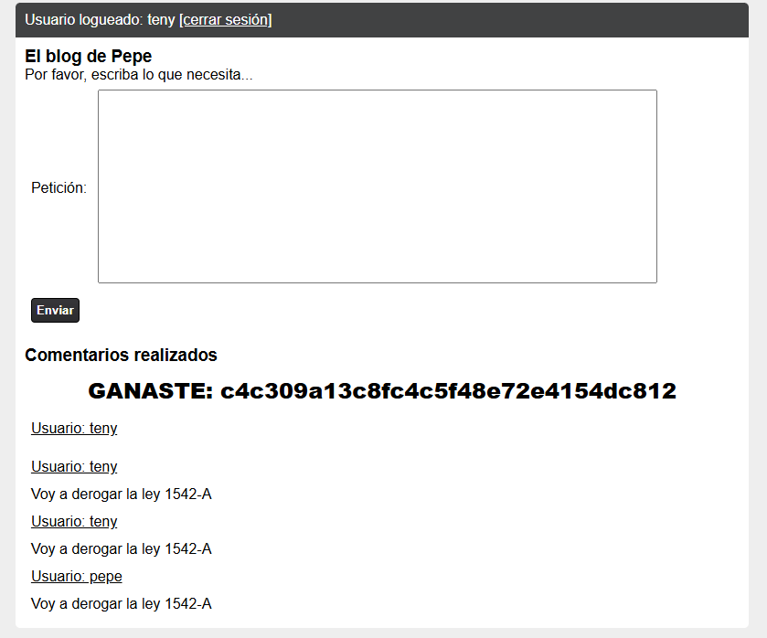

# El blog de Pepe segurizado - SoftwareSeguro

**Dificultad:** CTF<br>
**Fecha:** 09/2026<br>
**Sistema:** Web<br>
**Objetivo:** Lograr que Pepe responda "Voy a derogar la ley 1542-A" en su blog<br>
**Acceso inicial:** Stored XSS mediante reutilización de nonce de CSP + Ingeniería Social

## Herramientas

`Chrome DevTools`

## Técnicas

`Stored XSS` `CSP Nonce Reuse` `Social Engineering` `HTTP Request Analysis`

## Introducción

El desafío presenta un blog con un formulario de comentarios protegido por una política CSP (Content-Security-Policy) estricta con `script-src` basado en nonce. Los comentarios publicados quedan visibles para todos los usuarios, incluido Pepe (el político) cuando ingresa al blog. El sitio ofrece además una funcionalidad de "ingeniería social" que obliga a Pepe a ingresar al blog bajo demanda (con un límite de una vez por minuto), pero sin poder atacar esa funcionalidad en sí. El objetivo es lograr que, al ingresar Pepe, el blog le haga enviar (en su nombre) el comentario "Voy a derogar la ley 1542-A".

## Reconocimiento

Al ingresar con las credenciales provistas (`teny` / `Teny1805`) se accede a la página principal del blog, que incluye:

- Un formulario de comentarios (`POST /comentarios.php`, campo `txtComentario`).
- Un listado de comentarios previos, reflejados sin escape visible en la tabla de resultados.
- Una política de seguridad declarada vía meta tag:

```html
<meta http-equiv="Content-Security-Policy" content="default-src 'self'; style-src 'self' 'unsafe-inline'; script-src 'strict-dynamic' 'nonce-NDM5OTA='">
<script nonce="NDM5OTA=" src="jquery-3.2.1.min.js" type="text/javascript"></script>
```

La política restringe la ejecución de scripts a aquellos que incluyan el nonce `NDM5OTA=` (o que cumplan `strict-dynamic` a partir de un script con ese nonce), bloqueando en teoría la ejecución de JavaScript inyectado por un atacante.

## Vulnerabilidad identificada

**Stored XSS mediante reutilización de nonce de CSP (CWE-79: Improper Neutralization of Input During Web Page Generation, combinado con una implementación débil de CSP — nonce estático/predecible en vez de generado por request)**

El valor del nonce (`NDM5OTA=`) se mantiene **constante** entre distintas cargas de la página, en lugar de regenerarse de forma aleatoria en cada request como exige un uso correcto de CSP con nonces. Al ser un valor fijo y visible en el propio HTML de la página (cualquier usuario autenticado puede verlo con Ctrl+U), un atacante puede incluirlo en un `<script>` propio y lograr que el navegador lo ejecute igualmente, ya que coincide con el nonce declarado por la política — anulando por completo la protección que el mecanismo de nonce está pensado para ofrecer.

Combinado con el hecho de que el campo de comentarios refleja el contenido ingresado sin sanitizar las etiquetas HTML, esto permite un **Stored XSS**: el payload queda guardado como comentario y se ejecuta en el navegador de cualquier usuario (incluido Pepe) que visualice la página de comentarios.

## Explotación

Se publica un comentario con el siguiente contenido, incluyendo una etiqueta `<script>` con el nonce reutilizado:

```html
<script nonce="NDM5OTA=">
    fetch('/comentarios.php', {
        method: 'POST',
        headers: {
            'Content-Type': 'application/x-www-form-urlencoded'
        },
        body: 'txtComentario=Voy+a+derogar+la+ley+1542-A&btnEnviar=Enviar'
    });
</script>
```

Al coincidir el nonce del `<script>` inyectado con el declarado en la CSP de la página, el navegador lo ejecuta sin bloquearlo. El script realiza una petición `POST` a `/comentarios.php` enviando como comentario el texto "Voy a derogar la ley 1542-A", simulando el envío legítimo del formulario.

Luego, utilizando la funcionalidad de ingeniería social provista por el desafío (indicando el dominio del challenge), se fuerza a que Pepe ingrese al blog. Al cargar la página de comentarios con la sesión de Pepe activa, el script inyectado se ejecuta en su navegador y envía automáticamente, en su nombre, el comentario con la frase solicitada.

## Resultado

El comentario "Voy a derogar la ley 1542-A" queda publicado en el blog bajo la sesión de Pepe, cumpliendo el objetivo del desafío.



## Impacto

La reutilización de un nonce estático en la CSP anula completamente la protección contra XSS que el mecanismo está diseñado para ofrecer: cualquier atacante capaz de inyectar HTML en la página (vía un campo sin sanitizar, como el de comentarios) puede ejecutar JavaScript arbitrario simplemente copiando el nonce visible en el propio código fuente. Combinado con una funcionalidad que fuerza a una víctima de alto valor (en este caso, un funcionario con capacidad de tomar decisiones reales) a visitar la página, esto permite ejecutar acciones en su nombre sin su conocimiento ni consentimiento — en este ejercicio, lograr una declaración pública; en un escenario real, podría usarse para robo de sesión, modificación de datos, o cualquier acción que la aplicación permita realizar a un usuario autenticado.

## Conclusión

El desafío demuestra que una CSP con nonces solo es efectiva si el nonce se genera de forma verdaderamente aleatoria y única en cada respuesta del servidor. Un nonce fijo o reutilizado es funcionalmente equivalente a no tener CSP: cualquier atacante puede leerlo del propio HTML y reutilizarlo en su payload inyectado. La combinación de esta falla con un campo de entrada sin sanitizar (Stored XSS) y un mecanismo que obliga a una víctima a cargar la página comprometida resultó en la ejecución de una acción no autorizada en nombre de otro usuario.

## Mitigación

1. Generar un nonce aleatorio y criptográficamente seguro en **cada respuesta del servidor**, nunca reutilizar el mismo valor entre requests.
2. Sanitizar/escapar correctamente cualquier input de usuario reflejado en el HTML (como el contenido de los comentarios), independientemente de la protección que brinde la CSP — son capas de defensa complementarias, no sustitutas una de la otra.
3. Validar que los scripts inline realmente necesiten estarlo; cuando sea posible, preferir archivos `.js` externos cargados desde `'self'`, reduciendo la superficie de ataque de scripts inline con nonce.
