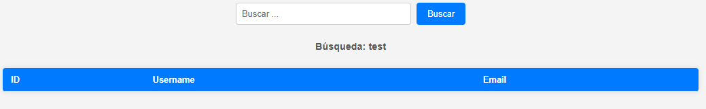
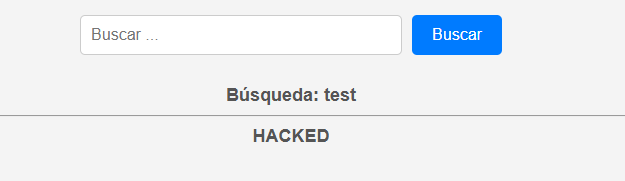
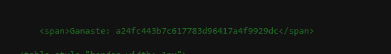

# Búsqueda de Usuarios - SoftwareSeguro

**Dificultad:** CTF<br>
**Fecha:** 09/2026<br>
**Sistema:** Web<br>
**Objetivo:** Lograr que el backend retorne un HTML inyectado (línea horizontal + "HACKED")<br>
**Acceso inicial:** Inyección HTML mediante parámetro `search` sin sanitización

## Herramientas

`Chrome DevTools`

## Técnicas

`Web Enumeration` `HTTP Request Analysis` `HTML Injection` `Reflected XSS` `HTML Comment Injection`

## Introducción

El desafío presenta un formulario de búsqueda de usuarios que consulta mediante el parámetro `search` y refleja el término buscado en la página ("Búsqueda: `<valor>`"), junto con una tabla de resultados. El objetivo es lograr que el backend retorne un HTML específico: el texto buscado, seguido de una línea horizontal (`<hr>`) y la palabra **HACKED** en mayúsculas, en vez de la tabla de resultados normal.

## Reconocimiento

Al acceder a la aplicación se observa un formulario con un campo de búsqueda y un botón "Buscar", que realiza una petición `GET` incluyendo el parámetro `search` en la URL:

```text
GET /?search=<valor>
```

Con una búsqueda simple (`search=test`) la aplicación responde mostrando "Búsqueda: test" y una tabla vacía con columnas `ID`, `Username`, `Email` (sin resultados, ya que `test` no coincide con ningún usuario).



## Análisis de la respuesta

Se observa que el valor de `search` se refleja directamente dentro de una etiqueta `<h5>` en el HTML de respuesta:

```html
<h5>Búsqueda: test</h5>
```

Esto sugiere que el valor ingresado por el usuario se concatena en el HTML del lado del servidor sin un proceso de escape/sanitización (no se transforman caracteres como `<` o `>` a sus entidades HTML correspondientes, `&lt;` / `&gt;`).

## Vulnerabilidad identificada

**Inyección HTML / Cross-Site Scripting reflejado (CWE-79: Improper Neutralization of Input During Web Page Generation)**

El parámetro `search` se refleja sin sanitizar dentro del HTML de la respuesta. Esto permite inyectar etiquetas HTML arbitrarias que el navegador interpreta como parte real de la página, en lugar de mostrarlas como texto plano. Al no haber ningún tipo de encoding de caracteres especiales (`<`, `>`, `!`, `--`), es posible tanto insertar elementos visuales propios (como un `<hr>`) como abrir un comentario HTML (`<!--`) que oculte el resto del contenido que el servidor agrega a continuación en la misma respuesta (en este caso, la tabla de resultados).

## Explotación

Se construye un payload que combina tres partes:

```text
test<hr>HACKED<!--
```

- `test` → se mantiene como el texto reflejado en "Búsqueda: test".
- `<hr>` → al no ser escapado, se renderiza como una línea horizontal real.
- `HACKED` → texto literal que se muestra tal como fue solicitado por el desafío.
- `<!--` → abre un comentario HTML sin cerrarlo, ocultando todo el HTML que el servidor concatena después (la tabla `<table>` de resultados y el resto del `<div>`).

El payload se envía mediante el parámetro `search` de la URL:

```text
GET /?search=test%3Chr%3EHACKED%3C%21--
```

## Resultado

El backend retorna el HTML solicitado: el texto de búsqueda, la línea horizontal y "HACKED", sin que se vea la tabla de resultados (queda oculta dentro del comentario HTML abierto).



## Obtención del código

Inspeccionando el código fuente de la respuesta (Ctrl+U) se encuentra, dentro del mismo `<div>`, un elemento no visible en el renderizado normal de la página con el código del desafío:

```html
<span>Ganaste: a24fc443b7c617783d96417a4f9929dc</span>
```



## Impacto

Una inyección HTML de este tipo, sin restricción sobre las etiquetas permitidas, habilita escenarios más graves que el de este desafío puntual: con las mismas condiciones (ausencia de sanitización y de una política de Content-Security-Policy restrictiva) sería posible inyectar `<script>` para ejecutar JavaScript arbitrario en el contexto de la víctima (XSS reflejado clásico), permitiendo robo de cookies de sesión, suplantación de identidad o redirección a sitios maliciosos si el link con el payload es compartido con otro usuario.

## Conclusión

El desafío demuestra cómo la ausencia de sanitización/escape de caracteres especiales al reflejar input del usuario en el HTML de una página permite inyectar contenido arbitrario, incluyendo elementos visuales (`<hr>`) y comentarios HTML (`<!--`) capaces de ocultar partes legítimas de la respuesta del servidor.

## Mitigación

1. Escapar (HTML-encode) todo input de usuario antes de reflejarlo en el HTML de la respuesta (`<` → `&lt;`, `>` → `&gt;`, etc.), tanto en el valor mostrado como en cualquier atributo HTML relacionado.
2. Utilizar mecanismos de templating que escapen por defecto (auto-escaping), en lugar de concatenar strings manualmente para construir HTML.
3. Implementar una Content-Security-Policy (CSP) restrictiva como capa de defensa adicional, que limite qué tipo de contenido puede ejecutarse o renderizarse incluso si una inyección HTML llegara a producirse.
