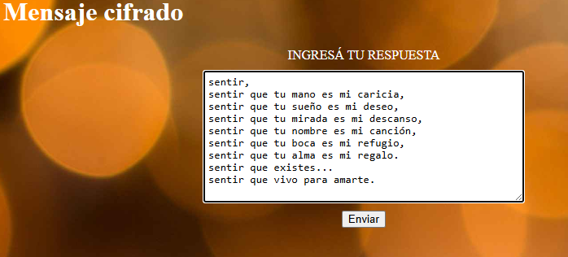
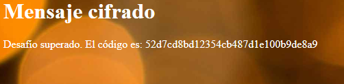

# Mensaje Cifrado - SoftwareSeguro

**Dificultad:** CTF<br>
**Fecha:** 09/2026<br>
**Sistema:** Criptografía<br>
**Objetivo:** Descifrar el mensaje cifrado con César y obtener el código del desafío<br>
**Acceso inicial:** Criptoanálisis por fuerza bruta sobre cifrado César con alfabeto personalizado

## Herramientas

`Python 3`

## Técnicas

`Classical Cipher Cryptanalysis` `Caesar Cipher` `Brute Force` `Custom Alphabet Analysis`

## Introducción

El desafío plantea que María le envía a su novio mensajes cifrados con un cifrado César, usando una clave que solo ellos dos conocen. Se provee el mensaje cifrado (dividido en 9 líneas) y el alfabeto personalizado de 34 símbolos utilizado por María (minúsculas con `ñ` y vocales acentuadas, además de coma, punto y espacio). El objetivo es recuperar el mensaje original.

## Reconocimiento

El mensaje cifrado, tal como lo entrega el enunciado, está dividido en 9 líneas, y el alfabeto provisto es:

```python
abc = [
    'a', 'b', 'c', 'd', 'e', 'f', 'g', 'h', 'i', 'j', 'k', 'l', 'm', 'n',
    'ñ', 'o', 'p', 'q', 'r', 's', 't', 'u', 'v', 'w', 'x', 'y', 'z', 'á',
    'é', 'í', 'ó', 'ú', ',', '.', ' '
]
```

Al tratarse de un cifrado César clásico, cada caracter del mensaje original se desplaza un número fijo de posiciones (`key`) dentro de este alfabeto. Al no conocer la clave, pero sí el alfabeto completo (34 símbolos), el espacio de claves posibles es pequeño y abarcable por fuerza bruta.

## Análisis y resolución

Se construye un script en Python que:

1. Une las 9 líneas del mensaje en un único string, eliminando los saltos de línea (`\n`) que separaban las líneas en el enunciado — estos saltos no forman parte del mensaje cifrado real, solo eran un recurso de formato del enunciado.
2. Para cada posible `key` entre `0` y `33` (el tamaño del alfabeto), recorre cada caracter del mensaje, busca su posición en `abc`, le resta `key`, aplica módulo por el tamaño del alfabeto (para manejar correctamente el caso circular, incluyendo posiciones negativas) y obtiene la letra correspondiente a la nueva posición.
3. Imprime el resultado de cada intento, para identificar visualmente cuál `key` produce un texto legible en español.

```python
mensaje = """wiqxmvb
wiqxmvduyidxydpeqsdiwdpmdgevmgmeb
wiqxmvduyidxydwyirsdiwdpmdhiwisb
wiqxmvduyidxydpmvehediwdpmdhiwgeqwsb
wiqxmvduyidxydqspfvidiwdpmdgeqgm qb
wiqxmvduyidxydfsgediwdpmdvijykmsb
wiqxmvduyidxydeopediwdpmdvikeosc
wiqxmvduyidiémwxiwccc
wiqxmvduyidzmzsdtevedepevxic"""

new_mensaje = mensaje.replace("\n", "")

abc = [
    'a', 'b', 'c', 'd', 'e', 'f', 'g', 'h', 'i', 'j', 'k', 'l', 'm', 'n',
    'ñ', 'o', 'p', 'q', 'r', 's', 't', 'u', 'v', 'w', 'x', 'y', 'z', 'á',
    'é', 'í', 'ó', 'ú', ',', '.', ' '
]

for n in range(len(abc)):
    key = n
    resultado = ""
    for i in range(len(new_mensaje)):
        letra = new_mensaje[i]
        posicion = abc.index(letra)
        nueva_posicion = (posicion - key) % len(abc)
        letra_nueva = abc[nueva_posicion]
        resultado = resultado + letra_nueva
    print("prueba con key " + str(n), "\n")
    print(resultado,"\n\n")
    print()
```

Recorriendo los resultados impresos, `key = 4` es la única que produce una frase coherente en español, mientras que el resto de las claves da texto ilegible.

## Resultado

Con `key = 4`, el mensaje descifrado es:

```text
sentir,sentir que tu mano es mi caricia,sentir que tu sueño es mi deseo,sentir que tu mirada es mi descanso,sentir que tu nombre es mi canción,sentir que tu boca es mi refugio,sentir que tu alma es mi regalo.sentir que existes...sentir que vivo para amarte.
```

## Obtención del código

La plataforma del desafío exige la respuesta formateada con cada frase en su propia línea, en minúsculas y sin espacios finales:



```text
sentir,
sentir que tu mano es mi caricia,
sentir que tu sueño es mi deseo,
sentir que tu mirada es mi descanso,
sentir que tu nombre es mi canción,
sentir que tu boca es mi refugio,
sentir que tu alma es mi regalo.
sentir que existes...
sentir que vivo para amarte.
```

Al enviar la respuesta en ese formato, el desafío se da por superado y se obtiene el código:



```text
52d7cd8bd12354cb487d1e100b9de8a9
```

## Conclusión

El desafío demuestra la debilidad estructural de un cifrado César clásico: al tratarse de un alfabeto de tamaño reducido y conocido (34 símbolos en este caso), el espacio de claves posibles es trivialmente abarcable por fuerza bruta, sin necesidad de ningún conocimiento previo de la clave real. Alcanza con identificar, de entre todas las salidas posibles, cuál produce un texto con sentido semántico en el idioma esperado.

## Mitigación

1. No utilizar cifrados por sustitución monoalfabética (como César) para proteger información sensible — son triviales de romper por fuerza bruta o análisis de frecuencias, independientemente del tamaño del alfabeto utilizado.
2. En caso de necesitar cifrado real, utilizar algoritmos criptográficos modernos y probados (AES, ChaCha20, etc.) con claves de longitud adecuada, en lugar de esquemas de desplazamiento simples.
