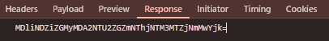

# Uso Inspector - UTN-FRC

**Dificultad:** CTF
**Fecha:** 09/2026
**Sistema:** Web
**Objetivo:** Obtener el código del desafío
**Acceso inicial:** Análisis del HTML + inspección de peticiones HTTP + manipulación de campo hidden

## Herramientas

`Chrome DevTools`

## Técnicas

`Web Enumeration` `HTTP Request Analysis` `HTML Inspection` `Parameter Manipulation` `Browser DevTools`

## Introducción

El desafío consiste en obtener un código generado por la aplicación mediante el análisis de las peticiones HTTP realizadas por el navegador.

La aplicación indica explícitamente que es necesario utilizar el inspector de un navegador web para:

1. Encontrar una petición cuya respuesta contenga un header `X-CODE`.
2. Copiar el valor de dicho header.
3. Introducirlo en un campo `hidden` presente en el HTML.
4. Presionar el botón de envío y obtener el código del desafío mediante la consola del navegador.

El objetivo es identificar correctamente la petición, extraer el valor del header y utilizarlo en el formulario.

## Reconocimiento

Al acceder a la aplicación se observa una página que contiene un formulario y un botón para enviar la información.

Mediante la inspección del HTML se identifica un campo oculto:

```html
<input type="hidden" id="code" value="">
```

El campo posee el identificador:

```text
code
```

y actualmente no contiene ningún valor.

Al tratarse de un campo de tipo:

```text
hidden
```

su contenido no es visible directamente en la interfaz de la aplicación, pero puede ser inspeccionado y modificado mediante las herramientas de desarrollo del navegador.

## Análisis de las peticiones

Se abre **Chrome DevTools → Network** para analizar las peticiones HTTP realizadas por la aplicación.

Durante el análisis se identifica una petición relevante hacia:

```text
/src/ctl/validate.php
```

La petición utiliza el método:

```text
POST
```

y responde con:

```text
200 OK
```

La petición observada corresponde a:

```text
POST /src/ctl/validate.php
```

Durante el análisis de la petición también se observa información enviada por el navegador, incluyendo un parámetro:

```text
token=bef93704e7050f99dce733f3978dcf08
```

Este valor corresponde a los datos enviados en la petición y no al código solicitado por el desafío.

## Identificación del header X-CODE

Dentro de la información de la respuesta de la petición se busca específicamente el header indicado por el desafío:

```text
X-CODE
```

El valor identificado es:

```text
f2ca1bb6c7e907d06dafe4687e579fce76b37e4e93b7605022da52e6ccc26fd2
```

Este valor es el que debe utilizarse para completar el campo `hidden` encontrado previamente en el HTML.

Es importante diferenciar el valor del header `X-CODE` de otros datos presentes en la petición, como el parámetro `token`.

## Manipulación del campo hidden

Una vez obtenido el valor de `X-CODE`, se vuelve a la pestaña **Elements** de Chrome DevTools.

Inicialmente el campo se encuentra de la siguiente manera:

```html
<input type="hidden" id="code" value="">
```

Se modifica temporalmente el atributo `value` para introducir el valor obtenido:

```html
<input type="hidden" id="code" value="f2ca1bb6c7e907d06dafe4687e579fce76b37e4e93b7605022da52e6ccc26fd2">
```

La modificación se realiza directamente desde el inspector del navegador.

Esto permite que, al enviar el formulario, el valor de `code` sea incluido en la información enviada por el cliente.

## Explotación

Con el campo `hidden` modificado, se vuelve a la página principal y se presiona el botón **Enviar**.

La aplicación procesa el valor introducido en el campo:

```text
code
```

y realiza la validación correspondiente.

No es necesario modificar el código fuente del servidor. La modificación realizada mediante DevTools afecta únicamente al HTML que está siendo utilizado por el navegador durante esa sesión.

## Obtención del código

Después de presionar el botón **Enviar**, se abre:

```text
Chrome DevTools → Console
```

La aplicación muestra en la consola el código correspondiente al desafío:

```text
MDliNDZiZGMyMDA2NTU2ZGZmNThjNTM3MTZjNmMwYjk=
```

Este valor corresponde al código solicitado por el desafío.

## Análisis del valor obtenido

El código mostrado presenta el formato:

```text
MDliNDZiZGMyMDA2NTU2ZGZmNThjNTM3MTZjNmMwYjk=
```



Su estructura es compatible con una representación **Base64**, debido a la presencia del carácter `=` al final.

Para completar el desafío no es necesario modificar ni decodificar este valor: el objetivo consiste en obtener el código mostrado por la aplicación en la consola.

## Cadena de explotación

```text
Inspección de la aplicación
        ↓
Chrome DevTools → Network
        ↓
Identificación de validate.php
        ↓
Análisis de Response Headers
        ↓
Identificación de X-CODE
        ↓
Obtención del valor de X-CODE
        ↓
Chrome DevTools → Elements
        ↓
Identificación del input hidden
        ↓
Modificación del atributo value
        ↓
Envío del formulario
        ↓
Chrome DevTools → Console
        ↓
Obtención del código
```

## Evidencia

Durante el análisis se identifican las siguientes evidencias:

### Campo hidden

El HTML contiene:

```html
<input type="hidden" id="code" value="">
```

Este campo debe ser completado con el valor obtenido del header `X-CODE`.

### Petición de validación

Se identifica la petición:

```text
POST /src/ctl/validate.php
```

con respuesta:

```text
200 OK
```

### Header X-CODE

El valor identificado es:

```text
f2ca1bb6c7e907d06dafe4687e579fce76b37e4e93b7605022da52e6ccc26fd2
```

### Campo modificado

El campo pasa a contener:

```html
<input type="hidden" id="code" value="f2ca1bb6c7e907d06dafe4687e579fce76b37e4e93b7605022da52e6ccc26fd2">
```

### Código obtenido

Finalmente, la aplicación muestra en la consola:

```text
MDliNDZiZGMyMDA2NTU2ZGZmNThjNTM3MTZjNmMwYjk=
```

## Conclusión

El desafío demuestra la utilidad de las herramientas de desarrollo del navegador para analizar el funcionamiento de una aplicación web.

Mediante **Chrome DevTools** fue posible identificar la petición de validación, inspeccionar sus headers de respuesta y encontrar el valor asociado a:

```text
X-CODE
```

Posteriormente, dicho valor fue introducido en el campo oculto:

```text
<input type="hidden" id="code" value="">
```

Finalmente, al enviar el formulario, la aplicación mostró el código del desafío en la consola:

```text
MDliNDZiZGMyMDA2NTU2ZGZmNThjNTM3MTZjNmMwYjk=
```

El ejercicio permite practicar conceptos fundamentales de análisis web, como la inspección del HTML, el análisis de peticiones HTTP, la identificación de headers de respuesta y la manipulación de parámetros controlados por el cliente.

## Evidencias

> Agregar aquí las capturas correspondientes al proceso:
>
> * Página inicial del desafío.
> * HTML mostrando el campo `hidden` con `id="code"`.
> * Pestaña Network mostrando la petición `validate.php`.
> * Response Headers mostrando `X-CODE`.
> * Campo `hidden` modificado con el valor de `X-CODE`.
> * Botón Enviar.
> * Console mostrando el código final.
